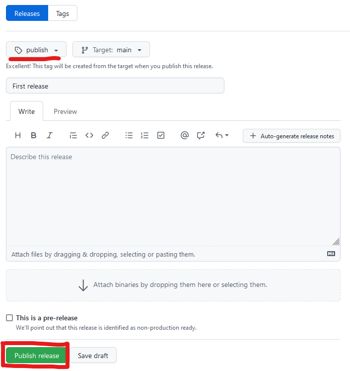

For research purposes, you often need to include the code and data of a project
into a paper. Because your learnt how to use git and GitHub throughout
this course, we suppose your project is on GitHub. However, giving the link
of your GitHub project is not enough. Why? Because we never know what will
happen to this private company that could disappear someday.
Citing only the URL of your project is also not very specific: which version
are you referring to?

That's where [Zenodo](https://zenodo.org) comes in handy. It's a repository
that let you upload any kind of data online and assign them
**D**igital **O**bject **I**dentifiers (DOI). DOIs are much easy to cite,
more specific, and should be up for longer than URLs.

> Why use Zenodo? (according to its website)
>
> *  **Safe** — your research is stored safely for the future in CERN’s Data Centre for as long as CERN exists.
> *  **Trusted** — built and operated by CERN and OpenAIRE to ensure that everyone can join in Open Science.
> *  **Citeable** — every upload is assigned a Digital Object Identifier (DOI), to make them citable and trackable.
> *  **No** waiting time — Uploads are made available online as soon as you hit publish, and your DOI is registered within seconds.
> *  **Open** or closed — Share e.g. anonymized clinical trial data with only medical professionals via our restricted access mode.
> *  **Versioning** — Easily update your dataset with our versioning feature.
> *  **Git**Hub integration — Easily preserve your GitHub repository in Zenodo.
> *  **Usage** statistics — All uploads display standards compliant usage statistics

One of the advantage if you're using GitHub is that there is already
[a simplified way](https://docs.github.com/en/repositories/archiving-a-github-repository/referencing-and-citing-content)
to archive your GitHub repository on Zenodo.

## 1. Access your GitHub project

Login in GitHub and navigate to your project page.

## 2. Login with GitHub on Zenodo

## 3. Go in the GitHub menu on Zenodo

## 4. Navigate your project list and toggle Zenodo

## 5. Go back on GitHub and create a release

## 6. Go back on Zenodo to get the corresponding DOI and project page

