You can access your last commit on GitHub in a very similar fashion
to `git show`. Find the commit in the top right corner of the repository.

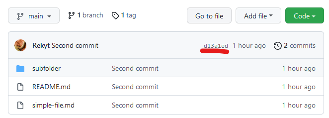

Then you can click on it to get the detail of the commit.

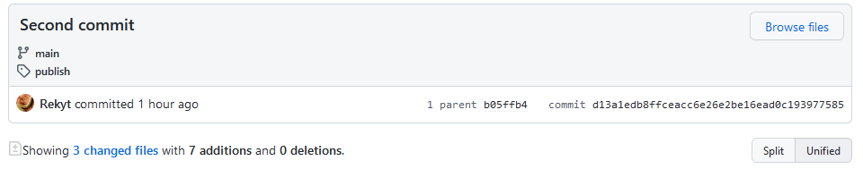

Similar to `git log` you can see the history of your commits in the project.

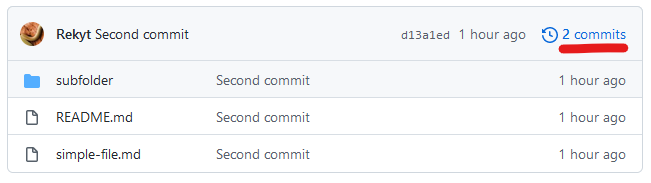

If you click on it you see the list of commits of your project.

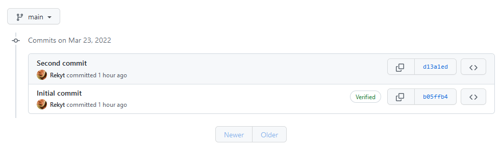

Through the GitHub interface you can also look at individual files.
For this hover your mouse on a file name and click on it.

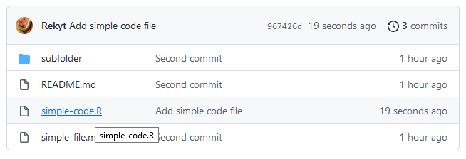

Then you can access the file interface of GitHub.

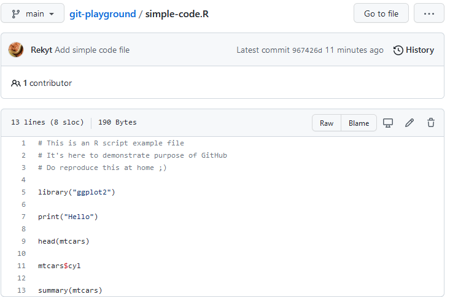

The window is split between the line numbers, the file name, the actual content
of the file and many other features.

One of the most useful one is that you can always access the raw version of
the file which makes it very simple to download.
For that click on the "Raw" button on the top right corner of the file.

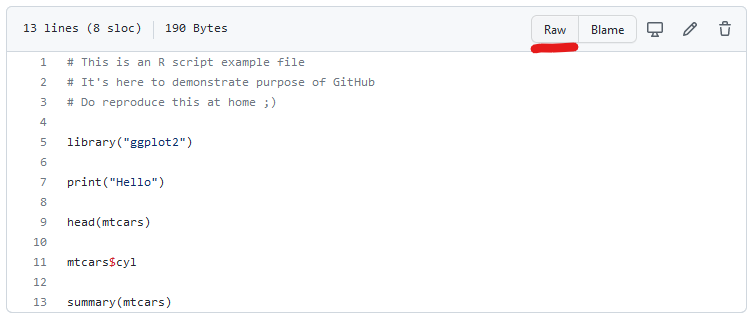

You can also access the commit history of a file by clicking on the history
button in the top right, it will display a list of commits affecting that file.

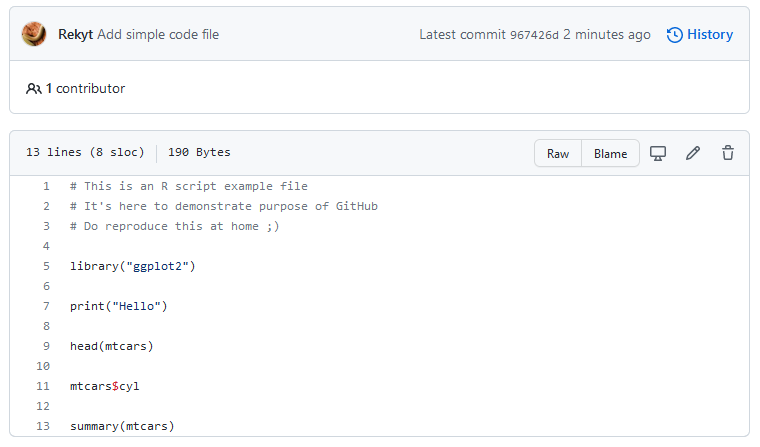

Through the GitHub interface it is also possible to add collaborators to your
project, so that they can also commit on the repository.
To do that you have first to access the "Settings" tab of your project.

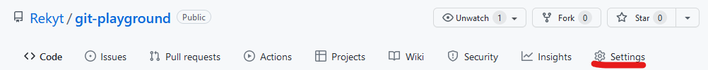

Then from there you have to click on "Collaborators" in the menu on the left.
GitHub will ask you to confirm your password for security reasons.

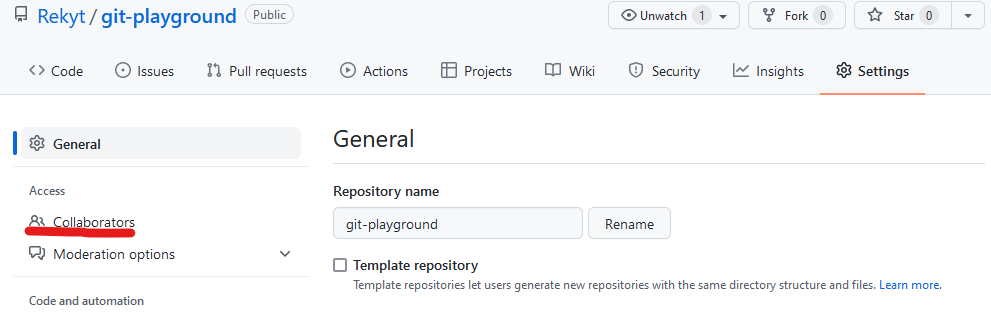

Then click on "add people" to search for people by their GitHub username to add
them to the project.

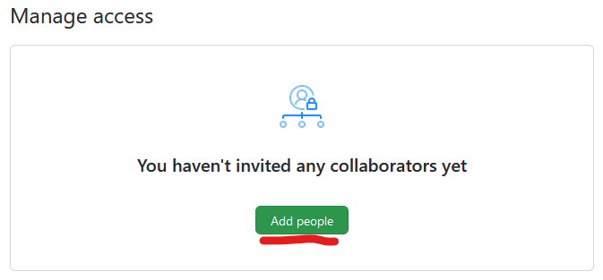

One additional interesting feature are "GitHub issues". There messages that can
form discussions, and you can track independent bugs and ideas with them.
There are quite commonly used to track the progress (what has been done and
needs to be done) of a project.
